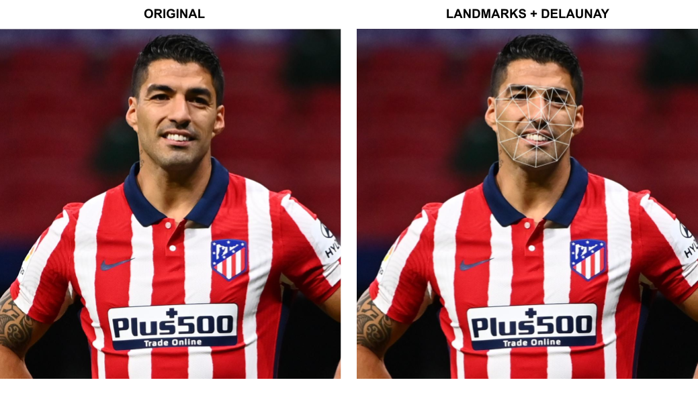

# Dlib Face Detection + OpenCV Delaunay Triangulation

This project aims to guide you in the process of face detection and landmark recognition, using 
[Dlib](http://dlib.net/) library. In addition, it shows how to visualize the results using [OpenCV](https://opencv.org/) 
and using two techniques known as: delaunay triangulation and voronoi diagrams.



### Requirements
Before running anything, you must install the project dependencies: 

```
opencv-python==4.5.1.48
numpy==1.19.5
dlib==19.21.1
imutils==0.5.4
```

You can run pip install to install all the dependencies at once or install it one by one. This process may take a few minutes.

```bash
pip install -r requirements.txt
```
### Usage

The project has two main modules: `` face_recognition.py``` where you will find everything related to 
face detection and landmark recognition, and ```delaunay.py``` where you will find the main script, 
delaunay triangulation, etc.


To run face detection and analysis for example for <i>Luis.jpg</i> photo, call ```delaunay.py``` as follows:

```bash
python delaunay.py --image Luis.jpg 
```

Also, you can change script behavior using different flags:

- ```--image``` : Path to image to process
- ```--vovonoi``` : Display face landmarks using Voronoi diagram
- ```--save``` : Save results as images
- ```--l28``` : Use only 28 of the 68 face landmarks returned by Dlib ```shape_predictor```.